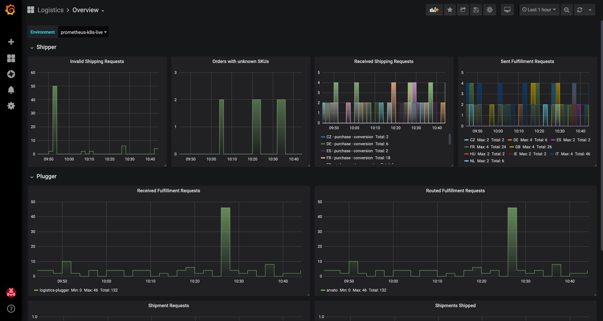

% Debugging Go Programs
% Tom Arrell
% Wed 12th Feb – Golang Meetup – Berlin

---

# About me

## Tom Arrell 

- Senior Backend Engineer @ SumUp
- Logistics Squad
- twitter:  twitter.com/tom_arrell
- github:   github.com/tomarrell

---

# Agenda

:::incremental
- Go at SumUp
- Go in Logistics
- Why we're moving to Go
- Debugging...
  - Primitive
  - GDB
  - Delve
  - Scenarios...
:::

---

# Go at SumUp

- Adopted within the last 2 years
- Mainly used for tooling
- First services written ~1 year ago
- Now migrating to Go for new services
- Deployed to Kube

---

# Go in Logistics

- Joined around ~6 months ago
- Legacy Python scripts
  - Lack of monitoring
  - Email alerts
  - Git clone deployment
- Replaced with Go services
  - Deployed to Kubernetes
  - Prometheus, Sentry, OpsGenie
- 2 engineers with no prior Go experience brought up to speed

---

# Go in Logistics


---

# Go in Logistics

{ width=350px }

---

# Go in Logistics



---

# Leaky Abstractions

> All non-trivial abstractions, to some degree, are leaky.
> 
> – **Joel Spolsky**

---

# Leaky Abstractions

{ width=350px }

---

# Ruby to Go


---

# Now what you came for... Debugging.

We'll take a look at a few contrived scenarios, and how we might be able to get
some more insight with as little (or as much) effort as possible.

---

# Words of Wisdom

> If you dive into the bug, you tend to fix the local issue in the code, but if
> you think about the bug first, how the bug came to be, you often find and
> correct a higher-level problem in the code that will improve the design and
> prevent further bugs.
>
> – **Rob Pike**

--- 

# fmt.Println()

> fmt.Println() is the most universal, and all powerful debugger. Fight me.
>
> – **Me, circ. now**

---

# fmt.Println()

```go
package main

import "fmt"

func main() {
  fmt.Println("HERE")
  go func() {
    fmt.Println("Why are you not running?!")
  }()
  fmt.Println("HERE 2")
}
```

---

# GNU Debugger

- Ok if you're using CGO
- Not so ok if you're writing plain Go
    - Defer statements
    - The scheduler, context switching
    - Custom type defs of builtin types
    - Some identifiers

---

# Delve 

- Dedicated debugger for Go programs
- Supports debugging:
  - Running processes
  - Examining core dumps
  - Built from scratch programs
  - Tests
  - Tracing

---

# Scenario #1: Race Conditions

> ...ignoring this prohibition [of data races] introduces a practical risk of
> future miscompilation of the program.
> 
> – **Hans-J. Boehm**

---

# Scenario #1: Race Conditions

> No race is a safe race.
>
> – **Me, just now**

---

*fin*

**Questions?**
